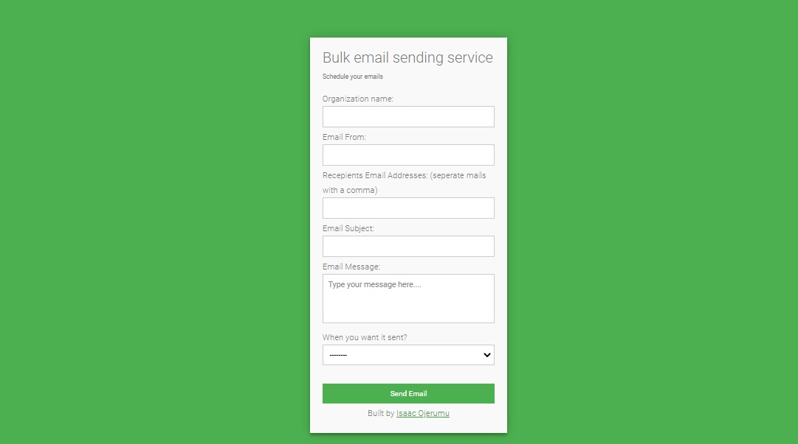
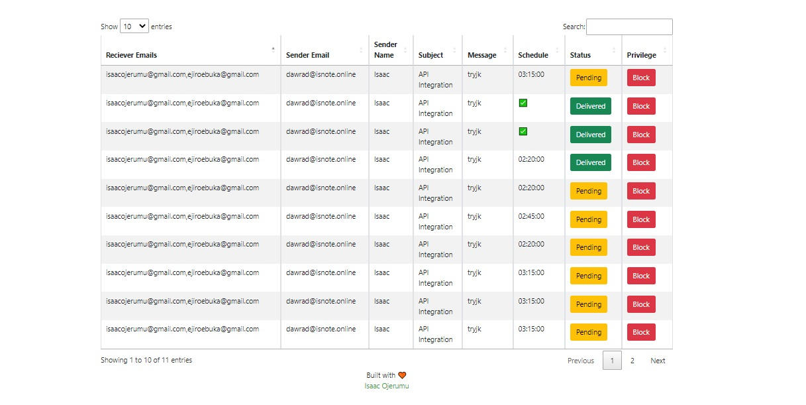

# DEMONSTRATING PHP QUEUE IN EMAIL SERVICE
This is a bulk email sending service that sends email at a particular time set by the user powered by PHP

## Requirements
- [PHP](https://www.php.net/downloads.php) version 7 or higher
- [MySQL](https://dev.mysql.com/doc/) The world's most popular open source database
- Web hosting eg: [Hostinger](https://www.hostinger.com/web-hosting), [Namecheap](https://www.namecheap.com/hosting/), [Domainking](https://clients.domainking.ng/store/web-hosting) or [XAMPP Server](https://www.apachefriends.org/download.html)

## How to install
- Clone the repository
- `git clone https://github.com/xyluz/php_queue_e.git`
- `cd php_queue_e`
- Spin off your development server

## Live test
- Try out the service [here](https://lunikdata.com/email-queue/)

## Notes

  

  

